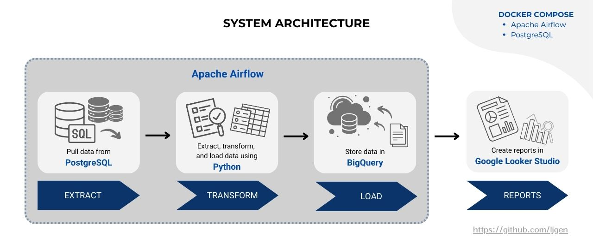

# E-commerce Data Warehouse & Batch Analytics Pipeline

## Project Overview


This project demonstrates the design and implementation of a batch-processing data pipeline for an e-commerce platform. It extracts data from a PostgreSQL database, performs necessary transformations, and loads the processed data into Google BigQuery. Business intelligence reporting is enabled via Google Looker Studio, providing actionable insights into sales and customer behavior.

## Tech Stack
- **Python**: Scripting for data extraction, transformation, and automation.
- **PostgreSQL**: Source database for raw e-commerce data.
- **Apache Airflow**: Orchestrates and schedules ETL (Extract, Transform, Load) workflows.
- **Google BigQuery**: Data warehouse for storing and querying transformed data.
- **Google Looker Studio**: Visualization tool for creating BI reports.
- **Docker Compose**: Manages multi-container Docker applications to streamline environment setup.

## Features
- Automated batch data extraction from PostgreSQL.
- Data transformation scripts to clean and prepare data for analysis.
- Efficient loading of transformed data into Google BigQuery.
- Scheduled workflows using Apache Airflow.
- Interactive dashboards in Google Looker Studio for sales and customer insights.
- Improved decision-making processes by reducing manual reporting efforts.

## Architecture
1. **Data Extraction**: Python scripts pull data from PostgreSQL.
2. **Data Transformation**: Data is cleaned and structured for analysis.
3. **Loading to BigQuery**: Transformed data is loaded into BigQuery.
4. **Visualization**: Google Looker Studio connects to BigQuery for reporting.

## Prerequisites
- Docker and Docker Compose installed.
- Google Cloud account with BigQuery and Looker Studio access.
- PostgreSQL database setup with e-commerce data from [Kaggle's E-commerce Dataset](https://www.kaggle.com/datasets/benroshan/ecommerce-data/data). 
- Python 3.10+ installed.

## Setup Instructions
1. **Clone the Repository**:

2. **Configure Environment Variables**:
   Create a `.env` file with the following variables:
   ```env
   POSTGRES_DB=your_database
   POSTGRES_USER=your_username
   POSTGRES_PASSWORD=your_password
   POSTGRES_HOST=your_postgres_host
   POSTGRES_PORT=your_postgres_port
   BIGQUERY_PROJECT=your_gcp_project
   BIGQUERY_DATASET=your_bigquery_dataset
   BIGQUERY_TABLE=your_bigquery_table
   ```

3. **Start Services with Docker Compose**:
   ```bash
   docker-compose up -d
   ```

4. **Access Apache Airflow**:
   Navigate to `http://localhost:8080` and log in with the default credentials (`airflow/airflow`).

5. **Trigger ETL Pipeline**:
   In Airflow, trigger the DAG named `ecommerce_etl_pipeline` to start the batch process.

6. **Set Up Looker Studio**:
   - Connect Google Looker Studio to your BigQuery dataset.
   - Use the provided templates or create custom dashboards for sales and customer insights.

## Folder Structure
```
.
├── dags
│   └── ecommerce_dag.py
│   └── ecommerce_data_prep.py
├── script
│   └── entrypoint.sh
├── .env
├── README.md
├── docker-compose.yml
├── requirements.txt
├── system_architecture.jpg
└── your_service_account_key.json
```

## Key Results
- **Enhanced Business Intelligence**: Automated reporting and dynamic dashboards reduced manual reporting time.
- **Improved Decision-Making**: Provided actionable insights into sales trends and customer behavior.
- **Scalable Architecture**: Easily adaptable to handle larger datasets and more complex workflows.

## Contributing
Contributions are welcome! Please fork the repository, create a feature branch, and submit a pull request.

---

Enjoy exploring insights from your e-commerce data!
