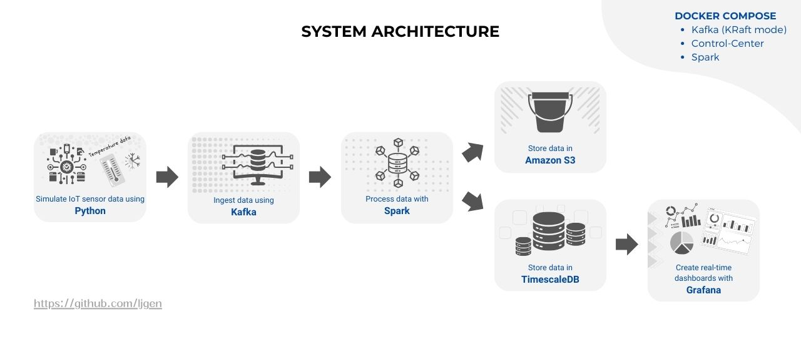
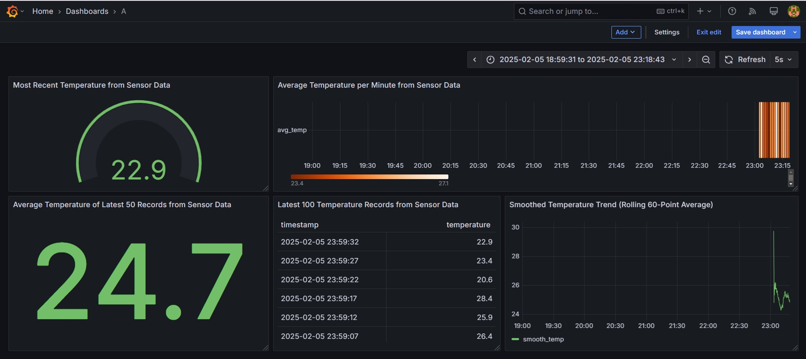

# End-to-End IoT Sensor Data Analytics (Real-Time)

## Project Overview


This project showcases the design and implementation of a real-time data analytics pipeline for IoT sensor data. The system captures, processes, and visualizes real-time data from IoT devices, enabling immediate insights and monitoring capabilities. Data flows from Kafka to PySpark for processing, with raw data stored in Amazon S3 and processed results saved in TimescaleDB (PostgreSQL). Real-time dashboards in Grafana provide interactive visualizations and facilitate data-driven decision-making.

## Tech Stack

- **Python**: Scripting for data generation, processing, and automation.
- **Apache Kafka**: Real-time data streaming platform for handling IoT data ingestion.
- **PySpark**: Distributed data processing for real-time analytics.
- **Amazon S3**: Storage for raw IoT sensor data.
- **PostgreSQL (TimescaleDB)**: Time-series database for storing processed data.
- **Grafana**: Visualization tool for real-time monitoring dashboards.
- **Docker Compose**: Simplifies deployment and management of multi-container environments.

## Features

- Simulated IoT sensor data generation using Python.
- Real-time data ingestion and streaming via Kafka.
- Distributed processing of streaming data with PySpark.
- Storage of raw sensor data in Amazon S3 for long-term retention.
- Processed results stored in TimescaleDB for time-series analysis.
- Dynamic Grafana dashboards for real-time insights and device monitoring.
- Scalable and modular architecture for easy extension and maintenance.

## Architecture

1. **Data Generation**: Python scripts simulate IoT sensor data.
2. **Data Ingestion**: Kafka streams real-time data from IoT devices.
3. **Data Processing**: PySpark processes streaming data for analytics.
4. **Data Storage**:
   - Raw data stored in Amazon S3.
   - Processed data saved in TimescaleDB.
5. **Visualization**: Grafana dashboards display real-time analytics and monitoring metrics.

## Prerequisites

- Docker and Docker Compose installed.
- AWS account with S3 bucket setup.
- PostgreSQL with TimescaleDB extension installed.
- Grafana setup for dashboard visualization.
- Python 3.10+ installed.

## Setup Instructions

1. **Clone the Repository**:

2. **Configure Environment Variables**:
   Create a `.env` file with the following variables:

   ```env
   AWS_ACCESS_KEY_ID=your_aws_access_key
   AWS_SECRET_ACCESS_KEY=your_aws_secret_key
   S3_BUCKET=your_s3_bucket_name
   POSTGRES_USER=your_username
   POSTGRES_PASSWORD=your_password
   POSTGRES_JDBC_URL=jdbc:postgresql://localhost:5432/your_database
   ```

3. **Start Services with Docker Compose**:

   ```bash
   docker-compose up -d
   ```

4. **Access Kafka UI** (Optional):
   Navigate to `http://localhost:9021` for Kafka monitoring.

5. **Run the IoT Data Generator**:

   ```bash
   python iot_sensor_data.py
   ```

6. **Access Grafana Dashboards**:
   Navigate to `http://localhost:3000` and log in. Connect Grafana to TimescaleDB and import the provided dashboard templates.

## Key Results

- **Real-Time Monitoring**: Enabled immediate insights into IoT device performance and data trends.
- **Scalable Processing**: Leveraged PySpark for efficient, distributed data processing.
- **Enhanced Decision-Making**: Provided dynamic, real-time dashboards for data-driven actions.

## Grafana Dashboard Using TimescaleDB Data

This Grafana dashboard visualizes data from TimescaleDB and can be adjusted to meet your needs.




## Contributing

Contributions are welcome! Please fork the repository, create a feature branch, and submit a pull request.

---

Enjoy exploring real-time insights from your IoT sensor data!
